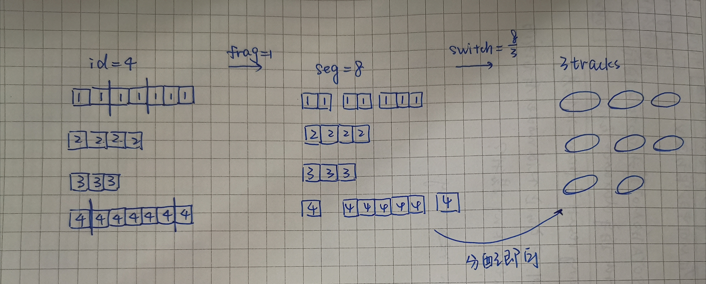

## 度量 tracking result 中 ID fragmentation 和 ID switch 两种错误形式的比例，指导利用 reid 数据集生成尽量接近真实的 tracking result.

比如利用 Market1501 生成 tracklets，最简单的方法就是将相同 camera、相同 id 的行人图片取出，按照 frame_idx 排成一个序列，即生成一个 fake tracklet。

但是此方式生成的 tracklets 是完全正确不含噪声的，这显然与真实的 tracklets 不一致，真实的 tracklets 结果中有两种常见的错误：id fragmentation（id n 出现在两个 tracklets 中）、id switch (一个 tracklet 中实际上追踪了不止一个人)。

所以这个 project 做的事情就是度量真实的 tracking results 中上述两种错误的比例，并最好能够方便的指导 fake tracklets 的生成。


## better_concat_same_id.py
将 deepsort 生成的所有 tracklets 分别拼成一张长图(concat/MOT16-09/tracking_10_2)，并求出每张图对应的 ground truth id，并绘制在长图上。每个 tracklets 的原始结果保存在 concat/MOT16-09/tracking_10_2.json.

求 ground truth id 的方法是：将 track bbox 与所有 gt bbox(frame_idx, type=1, consider=1)作 IOU 匹配，其中 iou 值最大的 gt bbox 对应的 gt id 就是这个 track bbox 对应的 gt id.

```
python better_concat_same_id.py
    --images_path tracking_results/MOT16-09/imgs_10_2
    --track_output_path output_10_2/MOT16-09.txt
    --gt_file_path gt/MOT16-09/gt/gt.txt
    --save_images_path concat/MOT16-09/tracking_10_2
    --save_json_path concat/MOT16-09/tracking_10_2.json
```

## frag_switch_cal.py
上述过程生成的 json 记录的是每个 tracklet 的原始结果，如 1:[2,2,2,2,2,2,2,3,3,4,4,4,4,4,4,4,2,2,2,2,2,2,2,-1,-1,-1]，首先要剔除掉 id_list 中连续出现不满 min_len(6) 的 id 以及 -1，然后将剩余的 id 去重，得到1:[2,4,2]，记录在 pro_xx.json 中。

对于 fragmentation, switch 的计算：

```
13: [1,3,3,2,2,1]
14: [2,2,3,4,3]
15: [4,1,4]

13: (1,2,3)
14: (2,3,4)
15: (1,4)
共 8 segmentations

frag: (seg - gt_id) / gt_id = (8 - 4) / 4 = 1
表示平均每个 id 分裂1次。

switch: seg / tracklets = 8 / 3
表示平均每个 tracklet 包含 8/3 个不同的 id。

除了计算 frag 和 switch，还会计算含有不同数目 id(seg) 的 tracklets 的占比：
例
frag: 2.292682926829268
switch: 1.2616822429906542
track num by #seg:
1,85 （有85个 tracklets 含有一个 id）
2,16
3,6
（其实利用 track num by #seg 的结果即可反向计算出 switch 的数值。）
```

```
python frag_switch_cal.py
    --json_path concat/MOT16-09/tracking_10_2.json
    --processed_json_path concat/MOT16-09/pro_tracking_10_2.json
```

### 利用 frag 和 switch 指导 fake tracklets 的生成

```
(id num) ---frag---> (segmentation num) ---switch---> (tracklets num) ---不同seg数量的tracklet比例---> (不同种 tracklets 的num)

```
